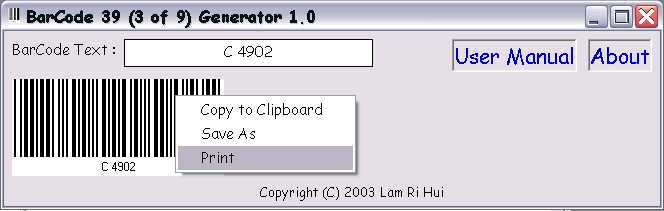



## BarCode 39 \(3 of 9\) Generator 1\.0

### Description

I always looking for a barcode generator but I didn't find any. So, I decided to make a barcode generator myself instead. I would like to credit someone from PSC but I can't remember his name. This code can generate barcode 39 (3 of 9) and you have 3 options: 1. Copy to clipboard and paste in to come graphic application. 2. Save the barcode as an image file and print when you need it. 3. Print the generated barcode immediately. Comments are welcomed. Please Vote for my work.
 
### More Info
 

             |
---                |---
**Submitted On**   |2003-09-03 22:28:54
**By**             |[Lam Ri Hui](https://github.com/Planet-Source-Code/PSCIndex/blob/master/ByAuthor/lam-ri-hui.md)
**Level**          |Beginner
**User Rating**    |5.0 (40 globes from 8 users)
**Compatibility**  |VB 5\.0, VB 6\.0
**Category**       |[Complete Applications](https://github.com/Planet-Source-Code/PSCIndex/blob/master/ByCategory/complete-applications__1-27.md)
**World**          |[Visual Basic](https://github.com/Planet-Source-Code/PSCIndex/blob/master/ByWorld/visual-basic.md)
**Archive File**   |[BarCode\_39164115942003\.zip](https://github.com/Planet-Source-Code/lam-ri-hui-barcode-39-3-of-9-generator-1-0__1-48268/archive/master.zip)

